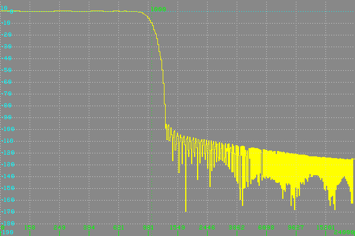
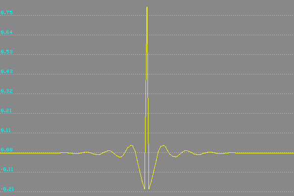
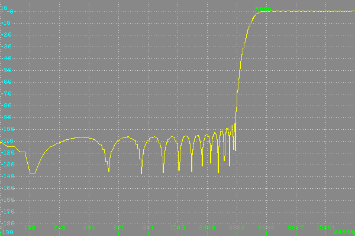

# filters
Digital filter calculator and frequency analyzer. Uses fast Fourier transform (**FFT**) for calculations.

Filters can be used for processing audio or other signals.

### Impulse response

Allows to calculate filters with finite impulse responce (**FIR**):

- low-pass using Kaizer windowing
- high-pass using Kaizer windowing
- low-pass without windowing
- high-pass without windowing

Filters with specified cutoff frequency and symmetrical finite impulse response are generated (without phase distortion of processed signals).

Graph with impulse response can be drawn and saved to a separate image file in BMP of GIF format. You must specify only output folder, file name is generated automatically, e.g.:
<pre>
LowPass_255pt_5000hz_imp_wnd.gif
</pre>
Where:

- LowPass (or HighPass) - filter type
- 255pt - length (in points) of filter's impulse response
- 5000hz - filter's cutoff frequency in Hz
- wnd - Kaiser window is applied to the response ('nownd' instead)

If no image width is specified, full length of impulse response is used as output width.

### Frequency response

Frequency response can be drawn:

- displaying absolute or dB values (top value and range in decibels can be specified) 
- with linear or exponential frequency scale
- with or without grid over the image
- with specified width and height in pixels

If no width is specified, full length of frequency response is used as output width, and linear frequency scale is used.

Result can be saved to image file in BMP or GIF format. You must specify only output folder, file name is generated automatically, e.g.:
<pre>
LowPass_511pt_1000hz_fft4096_exp_abs_wnd.gif
</pre>
Where:

- LowPass (or HighPass) - filter type
- 511pt - length (in points) of filter's impulse response
- 1000hz - filter's cutoff frequency in Hz
- fft4096 - length (in points) of fast Fourier transform used for generating frequency response
- exp (or lin) - exponential/linear type of frequency scale
- dB (or abs) - dB or absolute values of frequency response
- wnd - Kaiser window is applied to the response ('nownd' instead)

### Generating series of filters

You gan generate series of FIR filter responses with filter length increasing from specified length with specified step. Every frequency and/or impulse response are saved to a separate image file with image number at the end of filename, e.g.:
<pre>
HighPass_5000hz_fft4096_exp_abs_wnd_255pt_0005.gif
HighPass_5000hz_imp_wnd_255pt_0005.gif
</pre>

Images with series of responses can be saved to multi-frame GIF files if delay between frames is specified (in 1/100th sec), e.g:
<pre>
HighPass_5000hz_fft4096_exp_dB_wnd_127-415pt_10.gif
HighPass_5000hz_imp_wnd_127-415pt_10.gif
</pre>
`127-415pt_10` means series of 10 filters with length from 127 to 415 points.

You gan alse generate series of FIR filter responses with filter cutoff frequency increasing from specified one with specified step. Every frequency and/or impulse response are saved to a separate image file with image number at the end of filename, e.g.:
<pre>
HighPass_fft4096_exp_dB_wnd_127pt_5900hz_0010.gif
HighPass_imp_wnd_127pt_5900hz_0010.gif
</pre>
Images with series of responses can be saved to multi-frame GIF files if delay between frames is specified (in 1/100th sec), e.g:
<pre>
HighPass_5000-5900hz_10_fft4096_exp_dB_wnd_127pt.gif
HighPass_5000-5900hz_10_imp_wnd_127pt.gif
</pre>
`5000-5900hz_10` means series of 10 filters with frequency from 5000 to 5900 Hz.

### Processing audio file

You can also process audio stored in a WAV file with generated filter and save the result to output folder to WAV file with the same filename. All audio channels in the file are processed.

**IMPORTANT**: entire audio file is loaded and processed in memory (because of used `AudioFile` library), use this with care.

If series of filters is generated, only first filter is used for processing audio file.  

## Command line
<pre>
Usage: "filters.exe" [options]

options can be:
-help		display this help
-sr {N}		set sample rate to {N} Hz (can be 1000 to 100000, default is 48000)
-flthp {N}	generate high-pass FIR filter of {N} points length (127+ recommended)
-fltlp {N}	generate low-pass FIR filter of {N} points length (127+ recommended)
-fltfreq {N}	set {N} Hz frequency for low/high-pass FIR filter (must be less than half sample rate)
-fltwnd		calculate filter response with Kaiser windowing
-fltinv		calculate filter response using inverse FFT transform
-fft {N}	set {N} minimal points in FFT transform used for calculating/drawing frequency response
-outfolder	set output folder (will be created it doesn't exist) for saving image file(s)
-width {N}	set width of output image file to {N} pixels (at least 64)
	IMPORTANT: if width isn't specified then full response will be drawn
-height {N}	set height of output image file to {N} pixels (at least 64)
-dB		use vertical scale in decibels for drawing frequency response
-range {dB}	set vertical range (100 dB by default) for drawing in decibels
-top {dB}	set top of range (0 dB by default) for drawing in decibels
-exp {N}	draw with exponential frequency scale, starting from {N} Hz (can be 10 to 1000)
	IMPORTANT: width and starting frequency must be specified for exponential frequency scale
-grid		draw grid on frequency/impulse response
-bw		draw image in black and white (color by default)
-gif		save to GIF (color only) instead of BMP
-imp		save separate image with impulse response of generated filter
-stepsize {K}	set filter length step to {K} points (must be even) or frequency step to K Hz
	NOTE: step size can be negative for decreasing filter length or frequency
-lensteps {N}	generate {N} filters with length varying with {N} points step
	IMPORTANT: series of filters by length is generated if {N} > 1 and non-zero {K} (must be even)
-freqsteps {M}	generate {M} filters with frequency varying with {K} Hz step
	IMPORTANT: series of filters by frequency is generated if {M} > 1 and non-zero {K}
-delay {D}	save series of filters to multi-frame GIF with delay in 1/100th sec, {D} must be > 0
	IMPORTANT: multi-frame GIF is saved only if image width is specified
-wav {infile}	load WAV file, process with generated filter and save result to output folder
</pre>
### Examples
<pre>
filters.exe -outfolder D:\tmp\flt -fltlp 511 -fltfreq 2000 -exp 100 -dB -top 10 -range 200 -grid -width 1024 -height 600 -imp
</pre>
Saves frequency response of low-pass filter of 511 points length and 2000 Hz cutoff frequency to a BMP file in `D:\tmp\flt` folder, using exponential frequency scale, displaying values in decibels (top at 10 dB, range 200 dB) with grid on the image of 1024x600 pixels. Additional image file with impulse response of generated filter is saved to the same folder.
<pre>
filters.exe -outfolder D:\tmp\flt -gif -flthp 255 -fltfreq 5000 -dB -top 10 -range 100 -grid -height 800 -wav D:\audio\test.wav
</pre>
Saves frequency response of high-pass filter of 255 points length and 5000 Hz cutoff frequency to a GIF file in `D:\tmp\flt` folder, using linear frequency scale, displaying values in decibels (top at 10 dB, range 100 dB) with grid on the image of 800 pixels height. Width is determined by full length of resulting frequency response.
Also reads audio data from file `D:\audio\test.wav`, processes it with calculated filter and saves result to output folder as `D:\tmp\test.wav`
<pre>
filters.exe -outfolder D:\tmp\flt -flthp 127 -fltfreq 5000 -fltwnd -exp 100 -dB -top 10 -range 200 -grid -height 400 -width 600 -imp -lensteps 10 -stepsize 32 -wav D:\audio\test.wav -delay 50 -gif
</pre>
Saves series of 10 frequency and impulse responses of high-pass filter starting from 127 points length and 5000 Hz cutoff frequency to multi-frame GIF files in `D:\tmp\flt` folder, using exponential frequency scale, displaying values in decibels (top at 10 dB, range 200 dB) with grid on the image of 400 pixels height and 600 pixels width. Also reads audio data from file `D:\audio\test.wav`, processes it with 1st calculated filter and saves result to output folder as `D:\tmp\test.wav`

Resulting image with impulse response:

<pre>
filters.exe -flthp 127 -fltfreq 5000 -fltwnd -fft 4096 -outfolder D:\tmp\flt -exp 100 -dB -top 10 -range 200 -grid -height 400 -width 600 -imp -freqsteps 10 -stepsize 100 -delay 50 -gif
</pre>
Saves series of 10 frequency and impulse responses of 127-point high-pass filter with cufoff frequency starting from 5000 Hz to multi-frame GIF files in `D:\tmp\flt` folder, using exponential frequency scale, FFT with 4096 points size, displaying values in decibels (top at 10 dB, range 200 dB) with grid on the image of 400 pixels height and 600 pixels width.

Resulting image with frequency response:

## External libraries

These additional libraries are used:

- **fmt** for text formatting: [https://github.com/fmtlib/fmt.git](https://github.com/fmtlib/fmt.git)
- **FFT** calculation based on code from: [https://www.kurims.kyoto-u.ac.jp/~ooura/fft.html](https://www.kurims.kyoto-u.ac.jp/~ooura/fft.html)
- **ezdib** for drawing images in memory and saving to BMP format: [https://github.com/xiongyihui/ezdib](https://github.com/xiongyihui/ezdib)
- **gif-h** for saving images to GIF format: [https://github.com/charlietangora/gif-h.git](https://github.com/charlietangora/gif-h.git)
- **AudioFile** for reading and writing WAV audio files: [https://github.com/adamstark/AudioFile.git](https://github.com/adamstark/AudioFile.git)

